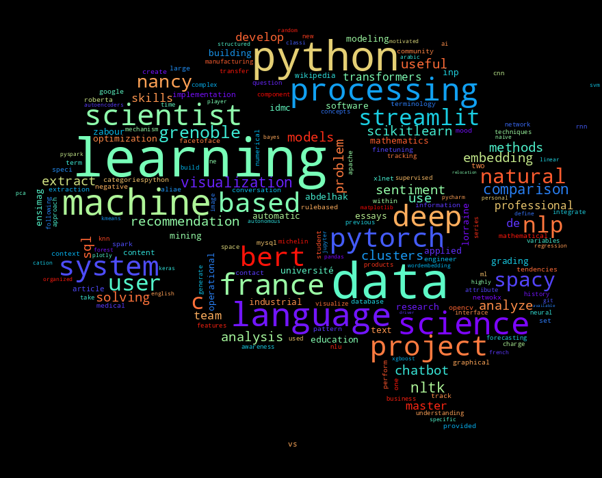

# Create WordCloud from PDF resume using Python and the Google Cloud Vision API



### To set up your Google Cloud Vision API, please refer to [this blog](https://towardsdatascience.com/how-to-extract-the-text-from-pdfs-using-python-and-the-google-cloud-vision-api-7a0a798adc13)

You should set up Google Cloud credentials to your Python environment using the JSON downloaded files. With this authentication, you will identify your computer to Google Cloud Services.

You can do that by defining the path to your JSON file.

```

# ! Add your credential JASON file path
os.environ["GOOGLE_APPLICATION_CREDENTIALS"]="path_to_credential_json_file.json"

```
### Set up a python environment
At this stage, you have set up everything needed on the Google Cloud Platform. To run the script that will generate the World Cloud of your resume, you will need to install some libraries.
You need to do some installation in your python environment - For my case, I worked with python3.7. you can use the requirements file provided on my GitHub repository to avoid dependencies conflicts, or you can simply install them by the following commend.

```
pip install google-cloud-storage google-cloud-vision matplotlib nltk numpy spacy grpcio wordcloud
```

You can run the script with the following commend

```
python ocr.py
```

Here's a side-by-side comparison of some of my results.

<table>
  <tr>
    <td>Resume</td>
     <td>WordCloud</td>
  </tr>
  <tr>
    <td></td>
    <td></td>
  </tr>
 </table>

