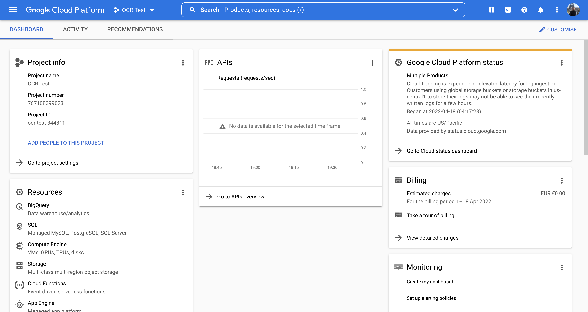
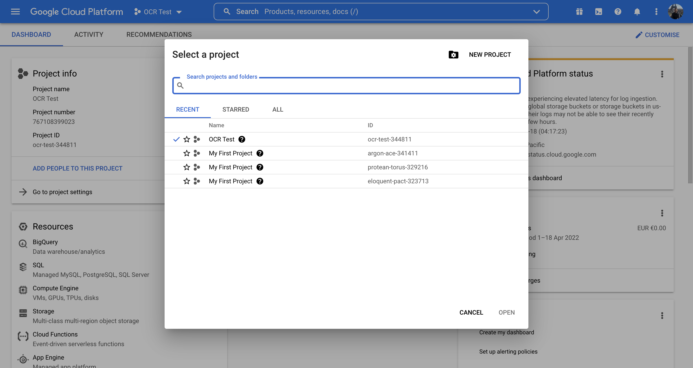
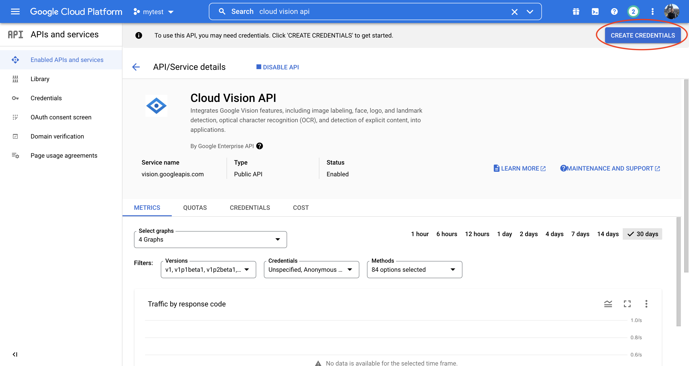
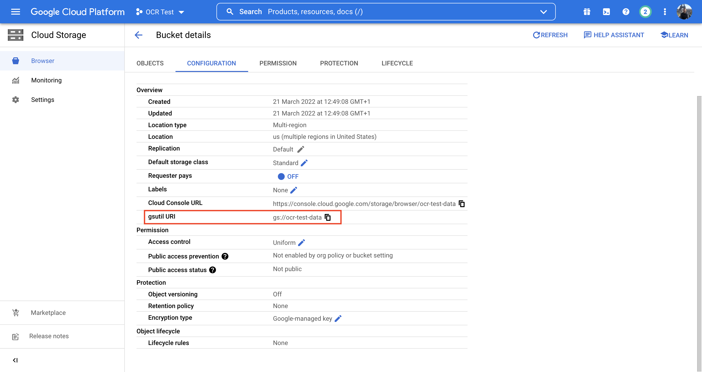

# How to display word cloud from PDF resume Using Python and the Google Cloud Vision API


While I am looking for a job after my graduation, I faced an issue of not getting interview calls for positions that I  played to, where I was sure that the jobs description overlaps with my skills.
So I began my search to know what is the problem, where I cam across of this online [WordCloud generator](https://monkeylearn.com/word-cloud/) to generate the word cloud for my resume and job description and visualize the most keys words represented in both text. The draw back of this that my resume was in pdf version, while copying the content the copied text was missing many words or miss spelling ones.
I tought using a powerful tool as Google Vision API will be the best way  to build similar application, and also could be extended to treat all kind of pdf documents with massive numbers.

For this reason I decided to write this guide to build an OCR for my resume.


## Technical requirement to succeed in thie tutorial 
* Python 3 and pip installed on your computer
* Editor for building the code — For my case I use VS Code
* You will also need an Google  Cloud account. You won't need to spend any money to complete this tutorial. You will need only a way of payment to register (credit Card, debit card, of Google wallet ).

## Setting up Your Google Cloud Vision Account

You must have a Google Cloud account to use Google Cloud Vision for optical character recognition. The first will allowed to access to Google's Cloud services dashboard. One of the various services available through this dashboard is file storage, which we will use to host the PDF file we will be converting to text.

Because the complex machine learning techniques that we will be using via the Cloud Vision API are cloud-based, we will need to submit our PDF to a "bucket" of files held by Google in order for it to be available.
This guide will walk you through the process of saving the final result, a text file containing all of the text in your PDF, to a spot on your computer.
1. In case you don't have a Google Cloud account, refer to this [link](https://cloud.google.com/) and create an account an log in.
2. Once signed in to your Google account, click this [link](https://console.cloud.google.com/home/) to access your Google Cloud dashboard. If you are prompted to accept the terms of service, do so. You should end up on a page similar to this one.


3. On the left top of the page click on the dropdown menu next to the Google Cloud Platform, in my case it says "OCR Test" yours you can name it as you wish. A window will popup( as you see in the image) click on "New Project" on the top right corner, give your project a name then click create. When you've finished creating your project, be sure you choose it by reopening the window and selecting it from the list of recent projects.


4. As seen in the picture above, you should now see the Project Info, APIs, and other information panels for your newly formed project. Click "Explore and Enable APIs" in the "Getting Started" section on the bottom left. This will allow you to select the Google APIs you want to use for this project.
5. Click "Enable APIs and Services" in the menu bar at the top of the screen. You will be sent to the API Library as a result of this. Look for "Cloud Vision API" and click on it. To make the API available to your project, click "Enable" This will lead you to your Cloud Vision API overview page. Click "Create Credentials" in the upper right corner of the screen.



6. You shoose Cloud vision API from the drop down menu under “Which API are you using?”, and select "Application Data", then "I am not using  them" from "Are you planning to use this API with Compute Engine, Kubernetes Engine, App Engine or Cloud Functions?" options. Then click done.

7. In the Cloud Console, go to "Service Accounts" then choose you project, then choose the service account name that you will remember, and set you role title to "Owner" 

8. You may now generate a key that will allow you to authenticate yourself while connecting to the Cloud Vision API. Please refer to this [link](https://cloud.google.com/vision/docs/setup#sa-create) to create a authenticator JSON file and download it containing your credentials.

You now have a project on Google Cloud Platform that can use the Cloud Vision API. The next step is to upload your PDF document/resume to the cloud for storage, and write a script to convert it to text.

9. It is now time to set up the storage that you will use to upload your documents. Scroll down until you find "Storage" in the navigation menu on the left side of the Google Cloud Platform. Clicking on it will bring up a drop-down menu. From the drop-down option, choose "Browser". If you haven't previously, you'll need to activate billing at this stage. If you have Google Pay, you may use it here; otherwise, you will need to enter payment information from another source. When you're finished, a dialogue should appear with the option to "Create a Bucket." Name your bucket a unique name. Within the project you created previously, this is a storage repository. Set the default storage class for your data to "standard" and the location to "multi-region." Click "Create".

You now have a bucket where you may upload files that will be accessible via any APIs configured for the current project. You may upload your resume by dragging and dropping it from your computer's desktop.

You are now prepared to develop a program that can access both this file and the Cloud Vision API by connecting to Google Cloud services and entering the key you obtained previously.

## Set-up python environment

At this stage, you have set-up everything needed on Google Cloud Platform. To develop a script that will generate World Cloud of your resume, you might need to install some libraries.

You need to do some installation in your python environment--For my case I worked with python3.7. you can use the __requirements__ file provided on the my __[Github](https://github.com/zaboura/gc-vision-api-script-ocr)__ repository to avoid dependencies conflicts, or you can copy them from the list bellow.

```
pip install google-cloud-storage google-cloud-vision matplotlib nltk numpy spacy grpcio wordcloud 
```

Finally, you should set-up Google Cloud credential to your Python environment using JSON downloaded file. With this authentication you will identify your computer to Google Cloud Services.


## Coding 

Now comes the exciting part: developing a script to conduct optical character recognition on our chosen PDF! Create a new Python file and open it in your favorite code editor. You can find the entire script here, as well as on my [Github](). For maximal rewarding, try to understand the script before download it.

### Import libraries

```
from google.cloud import vision
from google.cloud import storage
from wordcloud import WordCloud, STOPWORDS
from nltk.corpus import stopwords
from PIL import Image
import matplotlib.pyplot as plt
import json
import re
import calendar
import spacy
import numpy as np
import os

```

Vision and storage from google.cloud will allow us to use the Google Cloud Vision and Google Cloud Storage APIs and other libraries for text processing and visualization

In the following lines I will explain most important functions, for more details refer to my GitHub and read the comments.

```

def async_detect_document(gcs_source_uri, gcs_destination_uri):

    # Supported mime_types are: 'application/pdf' and 'image/tiff'
    mime_type = 'application/pdf'

    # How many pages should be grouped into each json output file.
    # you can add the number of document wanted to extract text from
    batch_size = 1
    # We specify the annotation process to text detection in pdf/image
    client = vision.ImageAnnotatorClient()

    feature = vision.Feature(
        type_=vision.Feature.Type.DOCUMENT_TEXT_DETECTION)
    # Define the mime type and the source path of documents
    gcs_source = vision.GcsSource(uri=gcs_source_uri)
    input_config = vision.InputConfig(
        gcs_source=gcs_source, mime_type=mime_type)

    # Define the destination path
    gcs_destination = vision.GcsDestination(uri=gcs_destination_uri)
    output_config = vision.OutputConfig(
        gcs_destination=gcs_destination, batch_size=batch_size)
    # We are making an asynchronous request using the input and output
    async_request = vision.AsyncAnnotateFileRequest(
        features=[feature], input_config=input_config,
        output_config=output_config)
    # We will be running will asynchronously batch-annotate files
    operation = client.async_batch_annotate_files(
        requests=[async_request])

    print('Waiting for the operation to finish.')
    operation.result(timeout=420)


```

This function accepts two arguments. The first parameter, gcs source uri, specifies the location of your PDF file in Google Cloud storage. The second parameter, gcs destination uri, specifies where you want the json files containing your file annotations to be saved in Google Cloud Storage.
A file location in Google Cloud storage is referred to as a URI. Consider it a URL within Google Cloud Storage or a route on your machine. It specifies where a certain file may be located in the hierarchy of files you maintain on Google Cloud. To locate the URI of a file, double-click on it to view its information and copy the URI from the table of data that appears.




```

def write_to_text(gcs_destination_uri):
    # Once the request has completed and the output has been
    # written to GCS, we can list all the output files.
    storage_client = storage.Client()
    # ! URI shoud have the format gs://bucket_name/folder_name
    match = re.match(r'gs://([^/]+)/(.+)', gcs_destination_uri)
    bucket_name = match.group(1)
    prefix = match.group(2)

    bucket = storage_client.get_bucket(bucket_name)

    # List objects with the given prefix.
    blob_list = list(bucket.list_blobs(prefix=prefix))[1:]
    print('Output files:')

    # transcription = open("transcription.txt", "w")

    for blob in blob_list:
        print(blob.name)
    # Process the first output file from GCS.
    # Since we specified batch_size=2, the first response contains
    # the first two pages of the input file.
    for n in  range(len(blob_list)):
        output = blob_list[n]

        json_string = output.download_as_string()
        response = json.loads(json_string)


        # The actual response for the first page of the input file.
        for m in range(len(response['responses'])):

            first_page_response = response['responses'][m]

            try:
                annotation = first_page_response['fullTextAnnotation']
            except(KeyError):
                print("No annotation for this page.")

            # Here we print the full text from the first page.
            # The response contains more information:
            # annotation/pages/blocks/paragraphs/words/symbols
            # including confidence scores and bounding boxes
            print('Full text:\n')
            print(annotation['text'])
            with open("transcription.txt", "a+", encoding="utf-8") as f:
                f.write(annotation['text'])
```

This function only accepts one argument: the URI of the location where our annotations were saved. In addition to publishing the results of the transcription in your terminal, it will save them to a text file in your currently active directory.

The generated file is saved in txt file locally. We read the text and apply text processing on it by removing stop words, personal information as these are not important. We also remove dates, places names.


```
if "__main__" == __name__:

    async_detect_document("gs://ocr-test-data/pdfs/Resume.pdf", "gs://ocr-test-data/results/")
    
    write_to_text("gs://ocr-test-data/results/")
    # Read text
    text = open("transcription.txt", "r").read()
    # Remove personal information
    text = personal_information_filter(text)
    # Process text, remove stopwords, ....
    text = process_text(text)
    # Display wordcloud of the text
    word_cloud_plot(text)

```
To run the app, you need to add the last chunk to the script with proper RUI, mine looks like above.


Congratulations! If everything went as planned, you should now have a text file containing a line-by-line transcription of all the machine-readable content in your PDF.
Here's a side-by-side comparison of some of my results.

<table>
  <tr>
    <td>Resume</td>
     <td>WordCloud</td>
  </tr>
  <tr>
    <td></td>
    <td></td>
  </tr>
 </table>

 ### All the code is available in my [GitHub repo](https://github.com/zaboura/gc-vision-api-script-ocr)